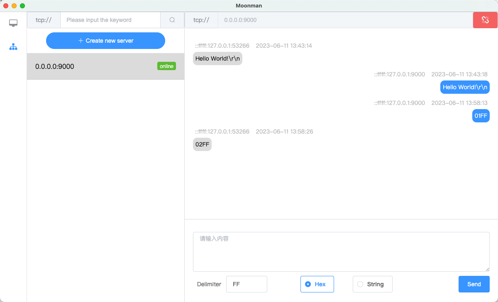
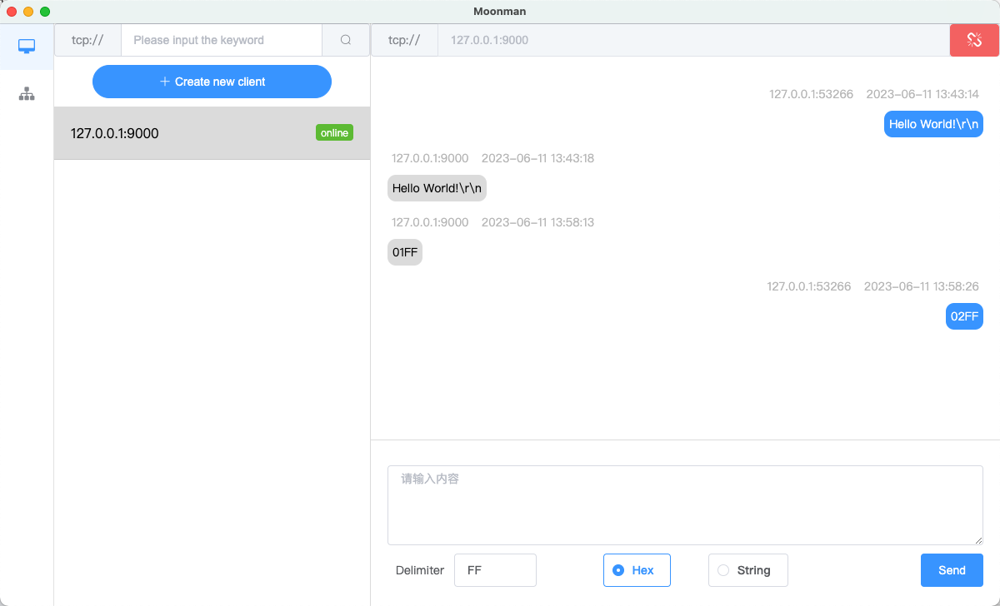

# Moonman

<p align="center"><a href="https://moonquakes.io/" target="_blank" rel="noopener noreferrer"></a></p>
<p align="center">
    
    
    
</p>

## Introduce

Moonman is a cross-platform desktop software that enables the creation and
management of TCP servers and clients.

Moonman can be used on multiple operating systems, such as Windows, macOS, and
Linux. This allows you to develop TCP server and client applications that are
compatible with various desktop environments.

With Moonman, you can create TCP servers, which listen for incoming connections
from TCP clients. TCP servers can handle client requests, perform actions based
on the received data, and send responses back to the clients.

Additionally, Moonman allows you to create TCP clients, which establish
connections to TCP servers. TCP clients can send data to servers, wait for
responses, and process the received data accordingly.

In addition to supporting TCP servers and clients, Moonman also provides support
for handling both string and hex content.

This means that you can use Moonman to create TCP servers and clients that can
send and receive data in two different formats: strings and hexadecimal values.

The ability to handle strings allows you to send and receive text-based data
over TCP connections. This is useful when dealing with human-readable
information or when working with protocols that use text-based message formats.

On the other hand, the support for hex content enables you to work with binary
data represented in hexadecimal format. Hexadecimal values are commonly used to
represent binary data in a more compact and readable form. This feature allows
you to send and receive binary information, such as raw bytes or encoded data,
over the TCP connections.

By providing support for both string and hex content, Moonman offers flexibility
in how you can communicate and exchange data over TCP connections. You can
choose the appropriate data format based on your specific requirements and the
protocols or systems you are interacting with.

## Preview

### Server



### Client



## Documentation and Downloads

[moonman.moonquakes.io](https://moonman.moonquakes.io)

## Build Setup

```bash
# install yarn
npm install -g yarn

# install dependencies
yarn

# serve with hot reload at localhost:9080
yarn dev

# build electron application for production
yarn build
```

## License

Source code in `moonman` is available under the [Apache-2.0 license](/LICENSE).
